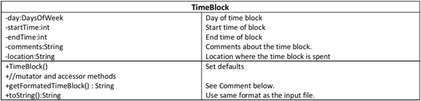
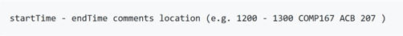
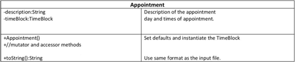
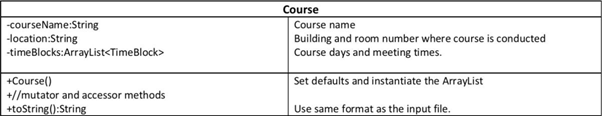
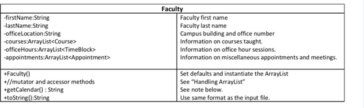
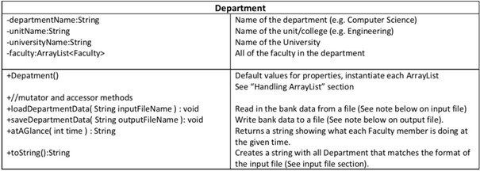
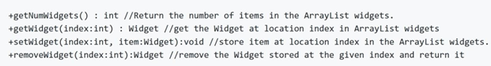
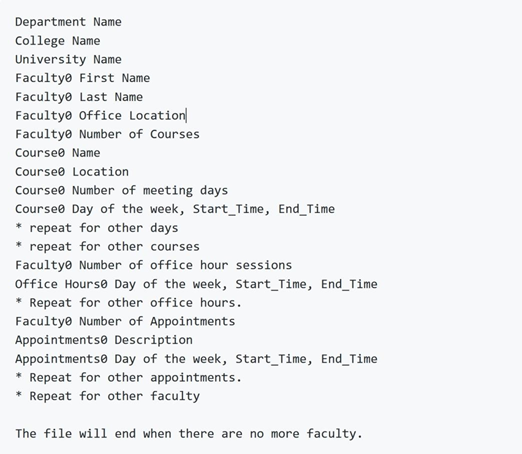

# Course_Chooser

Course analyzer

Discover a range of free learning content designed to help grow your business or jumpstart your career. You can learn by selecting individual modules, or dive right in and take an entire course end-to-end.

## UML DIAGRAMS

The method getCalendar() should return all course items,
office hour items and appointment items. Each item (i.e. formatted TimeBlock)
should be listed under a heading with the day of the week. Within a particular
day, the items should be listed in sorted order by time (Hint: Sorting is not
necessary -- use a loop that goes from 5 to 2400 by 5's.).

# The toString() method

---

The toString method should return a String formatted as in
the input file. Notice that TimeBlock.toString() will not include the location
or comment properties. Most classes will have each property on a new line,
TimeBlock properties will be separated by a comma.

# Handling ArrayLists

---

Each ArrayList should have five associated methods to
perform: getNum, add, get, set and remove. So if you have an ArrayList named
widgets that stored items of type Widget, then the associated UML would be:

# The toString() method

---

The toString method should return a String formatted as in
the input file. Notice that TimeBlock.toString() will not include the location
or comment properties. Most classes will have each property on a new line,
TimeBlock properties will be separated by a comma.

# Handling ArrayLists

---

Each ArrayList should have five associated methods to
perform: getNum, add, get, set and remove. So if you have an ArrayList named
widgets that stored items of type Widget, then the associated UML would be:

# Input File

---

The input file will be read by
the user using any file reader and input streams (BufferedReader or Scanner) to
your main() method using command-line arguments. The format for the input file
is shown below:

